# Palpicker

**Live Site:**

[Live webpage](https://8000-hinakhan94-palpicker-sjq20lkroo7.ws-eu105.gitpod.io/)

**Link to Repository:**

[Repository](https://github.com/HinaKhan94/palpicker)

## CONTENTS

- [Palpicker](#pal-picker)
  - [Table of Content](#table-of-content)
  - [Introduction](#introduction)
    - [Project Goals](#project-goals)
    - [Data Base Design](#data-base-design)
  - [User Experience - UX](#user-experience---ux)
    - [Strategy](#strategy)
    - [Scope](#scope)
    - [Structure](#structure)
    - [Skeleton](#skeleton)
    - [Surface](#surface)
  - [Agile Development](#agile-development)
  - [Existing Features](#existing-features)
  - [Future Features](#future-features)
  - [Technologies Used](#technologies-used)
    - [Languages](#languages)
    - [Python Modules \& Packages](#python-modulespackages-used)
    - [Frameworks \& Tools](#frameworks--tools)
  - [Testing and Validation](#testing-and-validation)
  - [Deployment \& Development](#deployment--development)
  - [Credits](#credits)
    - [Media](#media)
    - [Code](#code)
  - [Acknowledgements](#acknowledgements)

## Introduction

Palpicker- Find your Pal! is a community website where one can offer its services to foreign students in the city of Regensburg, Germany in exchange of money, lunch or friendship. Users can create an account to offer or request a service offered on the platform.

The project was designed as the 4th portfolio project of the Code Institutes Full Stack Diploma Program. It was built using Django, Python, JS, CSS, and HTML. The data are stored in a PostgreSQL database.

### Project Goals

The goal of the platform is to mainly have students/people with similar struggles and experiences, help out other students who are looking for any sort of service/guidance in the city of Regensburg,Germany. As it is a major challenge for almost every international student, in exchange of money, social interaction or just pure kindness. The offers/services can be edited and deleted by the user who created them. 

### Data Base Design

The Entity Relationship Diagram (ERD) illustrates the structure of the database which lies at the core of the functionality of the site:

A `User` Model is provided by Django, and a `Logentry Model` stores the details of each Post that a user makes, a user can add many posts. 

* [Back to Contents](#contents)

**Future Models**

- In the future, I would like to add a `Favorites` model, which would allow users to add posts to a list of Favorites and then allow them to be displayed on a separate view from other list-views.
- I would also like to add a `Feedback` model, which would allow users to post review for a specific host/user and give them a rating one a five star rating scale.
- I would also like to send email notifications to all new registered users and when their posts are approved by the admin.

## User Experience - UX

The application was developed considering the Five Planes of User Experience:

### Strategy

| EPIC                       | ID  | User Story                                                                                                                                                                               |
| -------------------------- | --- | ---------------------------------------------------------------------------------------------------------------------------------------------------------------------------------------- |
| **PROJECT CONTENT AND NAVIGATION** |     |                                                                                                                                                                                          |
|                            | 1A  | As a user, I want to see a navigation menu so I can easily move through the site.                                                                                                        |
|                            | 1B  | As a user, I want to see relevant information about the site and its content easily so I can decide if I want to register an account                                                     |
|                            | 1C  | As a user, I want to see an intuitive and visually pleasing design that matches the intent of the website.                                                                               |
|                            | 1D  | As a user, I can access different pages on the site, so that I can navigate smoothly through all the functionality of the site.                                                          |
| **ACCOUNT REGISTRATION AND USER**  |     |                                                                                                                                                                                          |
|                            | 2A  | As a user, I want to be able to register a profile, so I can access the main functionality of the site.                                                                                  |
|                            | 2B  | As a user, I want to be able to log into my account easily, so I can access my account.                                                                                      |
|                            | 2C  | As a user, I want to be able to log out of my account with ease to protect my account information.                                                                                       |
| **MANAGING POSTS**   |     |                                                                                                                                                                                          |
|                            | 3A  | As an authenticated user, I want to be able to create a post.     |
|                            | 3B  | As an authenticated user, I want to be able to edit and delete my posts so that I can customize them as I see fit.                                                                 |
| **USER VIEWS**             |     |                                                                                                                                                                                          |
|                            | 4A  | As a user, I want to be able to see all published posts by other users so that I can browse through them.                                                                              |
|                            | 4B  | As a user, I want to be able to view the detail of all posts made by others, so I can learn details about the services they are offering.                                                    |
|                            | 4C  | As a user,                                                                    |
|                            | 4D  | As an authenticated user, I want to be able to view all my posts including the pending approval status so that I can get a quick overview of my posts |

#### Target Audience

#### User Requirements and Expectations

- Simple and intuitive navigation system and design.
- Easy access to all functionalities of the site.
- All links and features work as expected.
- Immediate feedback on progress during interaction with site features.
- Visually appealing responsive design.
- Accessibility.

### Scope

**Simple and intuitive User Experience**

- Ensure the navigation menu is easily accessible and functions as expected.
- Ensure page names match the intended content.
- Ensure the user gets visual feedback when navigating through the site's functionalities.
- Create a design that matches the intent of the page.

**Relevant content**

- Add information about the site's purpose to make its intent clear to the user.
- Feature user-created content on the front page that helps the new user understand the purpose of the site.

**Core Website Functionality**

- Implement the registration/login/log out features for access to core site functionality.
- Implement a form for adding a post to the model.
- Implement a feature to edit and delete a post.
- Implement a feature that allows the user to add/edit/delete their user profiles.

**Responsiveness**

- Implement responsive design for smooth desktop, tablet, and mobile device access.

### Structure

The website is divided into 11 pages with content depending on whether the user is authenticated or not.

#### Current/Initial Structure

- **Home Page** is visible to both types of users. It includes a list of publically shared posts for the user to browse.
- **Register Page** allows the user to create an account to access the core functionality of the site.
- **Login/Logout Pages** allow the user to authenticate or log out of their account.
- **Create New Post Page** allows an authenticated user to create a new post to their account.
- **User Profile Page** allows authenticated user to see all their posts including those with the approved status and those that have not yet been published and are just saved as a draft.
- **User Profile Page** allows the user to view all the details of the post, if they are authenticated and it is their post they will see buttons that allow them to access the edit or delete features. They will also see a feature for adding/editing/deleting posts.
- **Edit Post Page** displays a prepopulated post form and allows the user to edit their previous inputs.
- **Contact Page** displays a contact form to authenticated and unauthenticated user to send in any queries to the admin.

* [Back to Contents](#contents)

### Skeleton

#### Wireframes

The wireframes for the pages listed in the above [Structure](#structure) section follow:

1. **Home Page**

- Unauthorized User View:

- Authorized User View:

2. **Offer Detail Page**

Unauthorized User

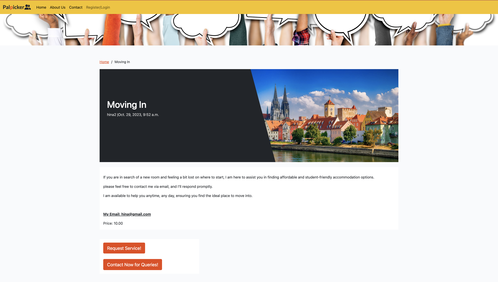

Authorized User

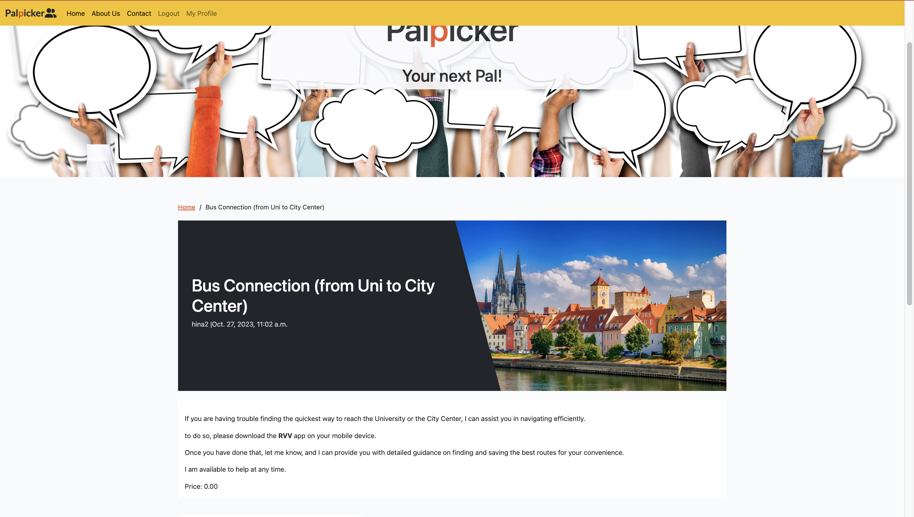
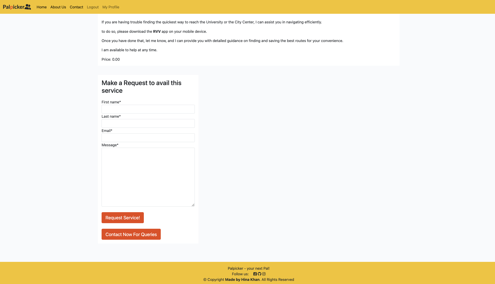

3. **My Profile View**

User Profile View

4. **Create a Post View**

Create a Post View

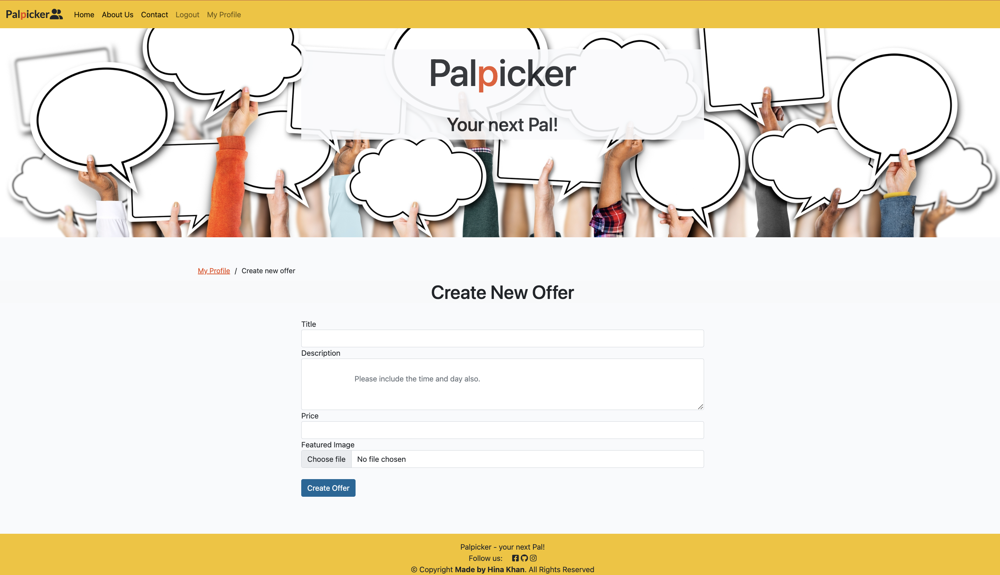

5. **Sign Up View**

Register

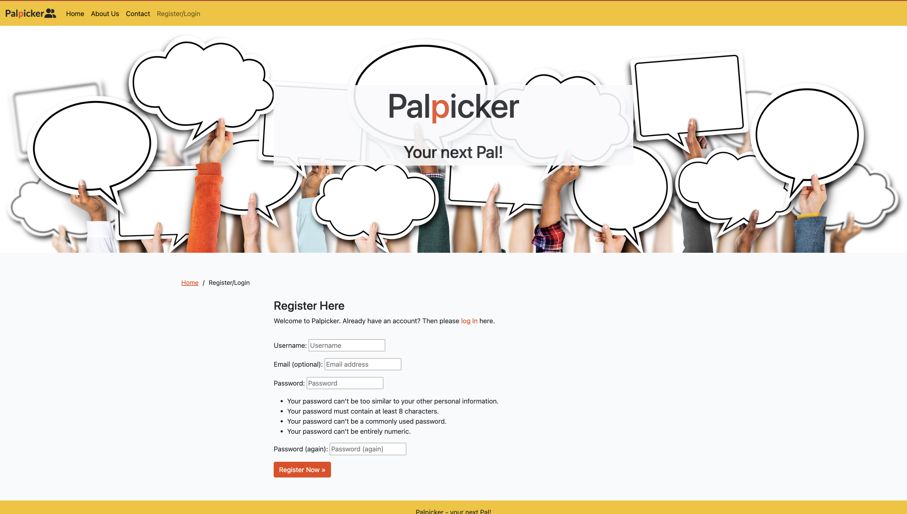

6. **404 Page** - a simple 404 Error page is also included (404.html)

### Surface

#### Color Scheme

#### Font

The site uses 'lato' and sans-serif as its fallback font.

* [Back to Contents](#contents)

## Agile Development

The development of this project was managed through GitHub issues, milestones, and projects.

### Sprints

- Sprint 1: Initial Set-up - October 15th, 2023 to October 16th, 2023

  - Setup CI template
  - Create the project and app
  - Install packages: django, dj_database, psyocpg2, cloudinary-storage, etc.
  - Update/create project files: settings.py, env.py, Procfile
  - Migrate changes
  - Setup database
  - Create a base.html

- Sprint 2: Post model and user authentication - October17th, 2023 to October 30th, 2023

  - Setup database models
  - Import static files for layout, CSS, JS, and images
  - Create an index.html and view
  - Add a view for the post model
  - Create a detail-view of the request model
  - Install allauth and crispy-forms
  - Add allauth templates to the workspace
  - Link up the login, log out, and signup templates to base.html
  - Add CSS styling to authorization pages
  - Setup a README file with a basic layout
  - Change materialize to bootstrap styling
  - Install crispy-bootstrap4
  - Style header and footer
  

- Sprint 3: Customized views and README - October 30th, 2023 to November 6th, 2023

  - Add ERD and goal section to README
  - Add delete post functionailty
  - Add content to README: UX, Deployment, and Development
  - Create a separate TESTING file with a layout

- Sprint 4: Refine and customize the CSS start testing - November 7th, 2023 to November 9th, 2023

  - Add Deployment and Development information to README
  - Add and finalize display of success-messages
  - First Lighthouse testing
  - Fixes based on Lighthouse testing
  - Set automated view testing
  - Add functionality to add/approve posts
  - MVP reached

- Sprint 5: Testing, Final revisions to code and documentation - November 10th to November 15th, 2023

  - Set up view, model, and form testing
  - install coverage package and compile coverage report
  - HTML testing, fixing errors and warnings
  - CSS testing
  - Python testing, fixing warnings
  - Delete commented code
  - Add test results and images to TESTING.md
  - Add content to the features section in README
  - Add LoginRequiredMixin to the relevant views
  - Carry out final revisions
  - Finalize README.md and TESTING.md
  - Proofread code and documentation
  - Set DEBUG to False
  - Final deploy

* [Back to Contents](#contents)

## Existing Features

### Header and Navigation

Navbar with logo, page name, and links. Different links are visible for unauthenticated users and authenticated. On small to medium screens the navigation links are displayed as a collapsible burger menu. 

- **Default navbar for unregistered user**

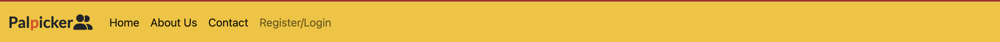

- **Navbar for registered user**

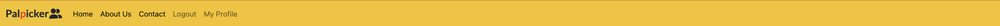

- **Navbar on mobile**

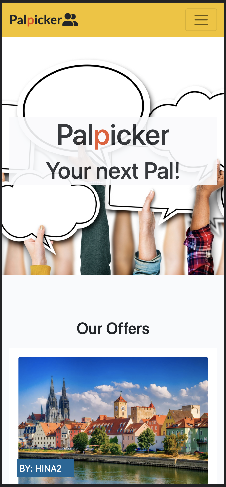

- **Navbar expanded on mobile**

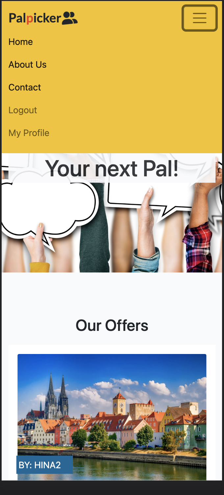

### Footer

- Footer with a slogan, links to several of the developer's pages, and a copyright feature.
- Footer is identical on all screen sizes.

### Account Features

**Create an account**

- Allows a user to sign up
- Fields include Username, Email (optional), Password, and Password confirmation

**Login to an account**

- Allows a user to login their account

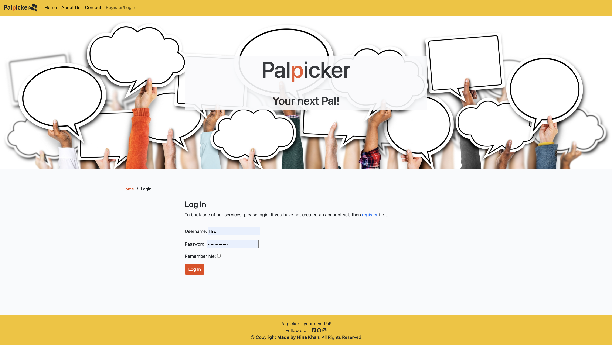

**Log out of an account**

- Allows a user to logout of their account

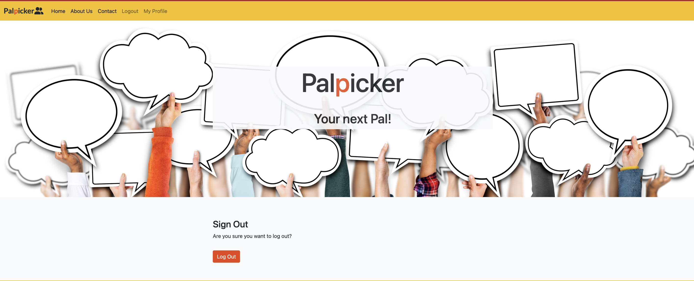

### Main Views

**Home Page**

Home page is same for all users.

- **Home Page for Unregistered Users**

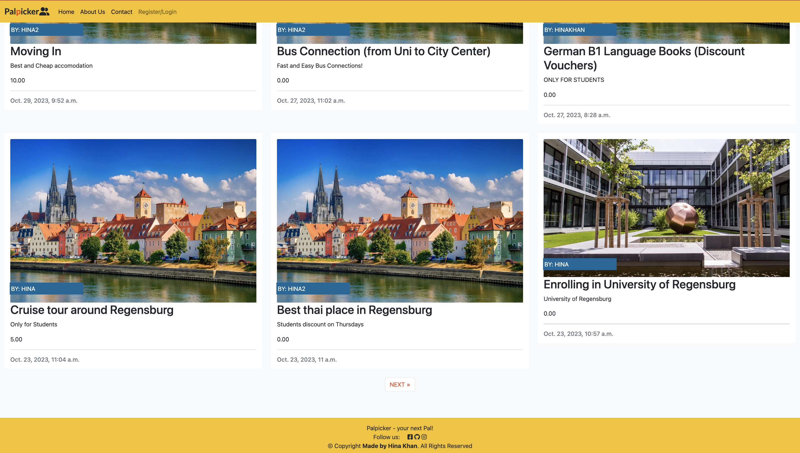
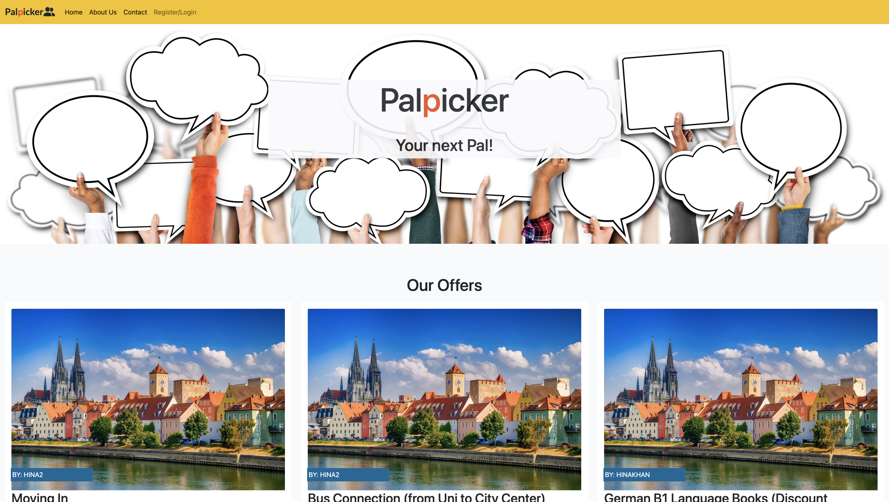

**User Posts**

- Allows registered users to see their posts including pending and approved.

**Post Detail View**

The Post Detail view allows both registered and unregistered users to view the details of a post by clicking on the title of the post on the various list view pages. The title, featured image, user's name and date is also mentioned. 

- View for Registered users with a contact button and request form.

- View for Unregistered users without the request form and a modal asking to register or login

* [Back to Contents](#contents)

### CRUD Functionality

All CRUD functionality is only available to registered users once they are logged in.

**Create a Post**

Allows the user to create a post. The fields included in the form are a title, description, featured image, excerpt, price 

**Edit a Post**

Allows the user to edit a post. The form is prefilled with all the details from the original entry.

**Delete a Post**

Allow the user to delete a post. The user will be prompted to confirm that they want to delete the entry.

### Success Messages

Every time a user carries out a function on the website, either as part of the account functionality or the CRUD functionality, a success message will be displayed confirming that the function was carried out successfully. Some of the messages are shown here but this is not an exhaustive list.

## Future Features

1. **List of Favorites Feature** -
   Creating functionality that lets the user add individual, publically available posts to a list of favorite Log Entries which can then be displayed in a 'My Favorites' View. Implementing this would involve adding a 'Favorite' model to models.py and then creating a view and template that displays the list based on the authenticated user.

2. **Delete Account Feature** -
   To give users ultimate control over their data a feature should be added that allows users to delete their account.

3. **Retrieve Password Feature** -
   A feature to allow the user to retrieve/reset their password if they have lost/forgotten it is also quite important and should be added for a more complete user experience.

4. **Google Login** -
   Allowing users to register and log in using Google would add ease of use for the user.

* [Back to Contents](#contents)

## Technologies Used

### Languages

- HTML - used as the main language to set up the structure of the website.
- CSS - used to customize the styling of the website.
- JavaScript - used to manipulate the DOM on various pages.
- Python - used to set up the core functionality of the site, such as models, and views.

### Python Modules/Packages used:

Several core packages were used, a few of the most important ones are listed here together with their functions:

- django - high-level Python web framework used to develop this application/site.
- psycopg2 - PostgreSQL database adapter for the Python programming language.
- dj3-cloudinary-storage - facilitates integration with Cloudinary by implementing Django Storage API.
- django-allauth - Integrated set of Django applications addressing authentication, registration, account management as well as 3rd party (social) account authentication.
- django-crispy-forms - provides a `crispy` filter and `` tag that allows control of the rendering behavior of Django forms in a very elegant and DRY way.
- crispy-boostrap4 - Bootstrap4 template pack for django-crispy-forms.

### Frameworks & Tools

- Django - used to set up the back-logic and user model on the website.
- GitHub - used to host the source code of the website. Also contains the record of the Agile development framework set up to plan the project, using issues, milestones, and projects on GitHub.
- Gitpod - used to write and develop the code for the website, and for committing and pushing code to GitHub.
- Heroku - used for live website deployment.
- Cloudinary - is a cloud storage solution for website media and other static files. It also allows for the manipulation and optimization of media delivery.
- Bootstrap - used throughout the site for responsiveness, layout, and predefined style elements.
- Balsamiq - used to create the project wireframes.
- MySQL - used for creating the ERD.
- Google Fonts - used to import fonts for the website.
- Font Awesome - used for icon features on the site.
- Canva - used to generate the color scheme.

## Testing and Validation

The testing documentation can be found at [TESTING.md]()

## Deployment & Development

### Deploy on Heroku

**Requirement and Procfile**

Before deployment on Heroku, two files need to be created and be up to date, a `requirements.txt` file and a `Procfile`.

- The `requirements.txt` file is created by executing the following command in the terminal window: ` pip3 freeze --local > requirements.txt`. A file with all requirements will be created.
- Then create a file named `Procfile` and insert the following code: `web: gunicorn worldtravels.wsgi`, with no empty lines after it.
- Then make sure to push these files to your repository.

**Creating Heroku App**

- Log into Heroku and go to the Dashboard.
- Click "New" and then select "Create new app".
- Give your app a name and select the region closest to you.
- Click "Create app" to confirm.

**Creating a database**

- Log into ElephantSQL.com and access your dashboard.
- Click "Create New Instance"
- Set up a plan, give your plan a **Name**, select the **Tiny Turtel (Free)** plan, leave the **Tags** field blank.
- Select "Select Region" and select a data center new you.
- Click "Review".
- Confirm your details and then click "Create instance".
- Return to the ElephantSQL dashboard and click on the database instance name for this project.
- In the URL section, click the copy icon to copy the database URL.
- In your workspace make sure django and gunicorn are installed by running `pip3 install 'django<4' gunicorn`.
- Equally make sure that infrastructure for the database is installed by running `pip3 install dj_database_url===0.5.0 psycopg2`.
- Update the `requirements.txt` file if needed.

**The env.py file**

- If you do not have a `env.py` file in your workspace create one and make sure it is included in the `.gitignore` file.
- At the top of the `env.py` file add the line: `import os`.
- Below that add the following two lines:

  `os.environ["DATABASE_URL"] = "<copied URL from SQL database>"`  
  `os.environ["SECRET_KEY"] = "<create a secret key of your own>"`  

- If you are using Cloudinary storage also add the following line:  

  `os.environ["CLOUDINARY_URL"] = "<copied URL from Cloudinary account>"` 

- Make sure the environment variables are imported correctly into the `settings.py` file.
- Run `python manage.py migrate` in the terminal window to migrate the data structure to the database instance.

**Setting Environment Variables**

- On the Heroku Dashboard select the app you just created and then select the "Settings" tab.
- Click "Reveal Config Vars"
- Add the following config vars:  

  `DATABASE_URL` - copy the database URL from ElephantSQL in here, it should also be in the `env.py` file.  
  `SECRET_KEY` - copy your secret key in here.  

- If you are using Cloudinary storage you also need to copy your personal `CLOUDINARY_URL` into these fields.  
- In addition, you may need the key `PORT` with value `8000`.

**Connecting to GitHub and Deploy**

- On the Heroku Dashboard select the app you just created and then select the "Deploy" tab.
- Select GitHub for the deployment method.
- Search for the name of the project repository and click "Connect".
- Further down the page, select "Enable Automatic Deploys" if desired.
- Then finally further down, select "Deploy Branch" and watch the app being built.

### Forking the Repository

- Log in to GitHub and locate the GitHub repository you want to fork.
- At the top of the Repository above the "Settings" Tab on the menu, locate the "Fork" Button and click it.
- You will have a copy of the original repository in your GitHub account.
- You will now be able to make changes to the new version and keep the original safe.

### Making a Local Clone

- Log into GitHub and locate the repository you want to clone.
- Click the 'Code' dropdown above the file list.
- Copy the URL for the repository.
- Open Git Bash in your IDE.
- Change the current working directory to the location where you want the cloned directory.
- Type `git clone` in the CLI and then paste the URL you copied earlier. This is what it should look like:
  `$ git clone https://github.com/`
- Press Enter to create your local clone.

You will need to install all of the packages listed in the requirements file you can use the following command in the terminal `pip install -r requirements.txt` which will do it for you.

* [Back to Contents](#contents)

## Credits

### Media

All images added by 

**Images:**

- Hero image was taken from [Raw Pixels](https://www.rawpixel.com/)
- Images for offers are taken from google.
- Default image used to display without a featured image is also taken from google.

### Code

Resources and inspiration came from a few sources:

- Especially during the initial setup of the project the Code Institute's 'I Think Therefore I Blog' Django walkthrough project was used to get started with the code.
- Several past projects, youtube videos, google search and Chatgpt were of great help to clarify functions and PEP8 requirements. Also it inspired the developer in implementing the functionality in line with the requirements of PP4 and reaching the MVP stage:
  - <a href="https://www.w3schools.com/">W3 Schools</a>
  - <a href="https://stackoverflow.com">Stack Overflow</a>

## Acknowledgements

I would like to thank:

- Medale Oluwafemi for your mentorship.
- Inspiration from  [rstan-dev](https://github.com/rstan-dev) for the contact page and user profile page design
- Inspiration from  [Ulrike Riemenschneider](https://github.com/URiem) for the Readme file.

