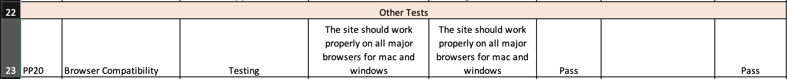

# PROJECT TEST DOC - Palpicker

## CONTENTS
* [TESTS PERFORMED](#tests-performed)
  * [Manual User Story Tests](#manual-user-story-tests)
  * [HTML](#html)
  * [CSS](#css)
  * [Lighthouse](#lighthouse)
  * [JSHINT](#jshint)
  * [PYLINT](#pylint)
  * [Browser Compatability](#browser-compatability)
  * [Automated Tests](#automated-tests)

  [Return to README.md](https://github.com/)

## TESTS PERFORMED
  The site was thoroughly tested during development. The tests included:
  1. Incremental testing
  2. Early user observation test
  3. Manual user story tests
  4. HTML, CSS, JSHINT, PYLINT, Lighthouse, PEP8
  5. Browser Compatability Tests
  6. Django Automated Tests

  ### Manual User Story Tests
  User story tests were conducted systematically, with any failing tests rectified. 
  

    
Click to View Manual User Story Test Evidence

      - 
      - 
      - 
      - 
      - 
    

  

  * [Back to Contents](#contents)

  ### HTML
  All HTML pages were checked with [NU HTML Checker](https://validator.w3.org/nu/)

  

    
Click to View HTML Test Evidence

      - 
      - 
      - 
      - 
      - 
      - 
      - 
      - 
      - 
      - 

  

  * [Back to Contents](#contents)

  ### CSS
  All CSS pages were checked with [JIGSAW W3 VALIDATION](https://jigsaw.w3.org/css-validator/)

  

    
Click to View CSS Test Evidence

      - 
  

   * [Back to Contents](#contents)

   ### JSHINT
  All JS pages were checked with [JSHINT](https://jshint.com/)

  

    
Click to View JSHINT Test Evidence

      - 

  

  * [Back to Contents](#contents)

  ### PYLINT
  All Python pages were checked with [CODE INSTITUTES PYTHON LINTER](https://pep8ci.herokuapp.com/)

  

    
Click to View PYLINT Test Evidence

      - 
      - 
      - 
      - 
      - 
      - 
      - 
      - 
      - 
     ">

  

  * [Back to Contents](#contents)

  ### LIGHTHOUSE
  A lighthouse report was run on the site following deployment on the Home Page and Dashboard Page
  * The performance issues are related to image sizes and have been noted in the Future Enhancements

  

    
Click to View LightHouse Test Evidence

      - 
      - 

  

  * [Back to Contents](#contents)

  ### PEP8
  During development, any PEP8 problems in the IDE tab were addressed.  The following were left as they are in the settings and env.py files and relate to specific links or security keys.

  

    
Click to View PEP8 Evidence

      - 

  

  * [Back to Contents](#contents)

  ### Browser Compatability
  - The site was tested using [Browserstack](https://www.browserstack.com/) to ensure compatibility across various browsers, Windows and Android, Chrome, Safari and Firefox.

  

    
Click to View Browser Test Evidence

      - 
      - 
      - 
      - 
      

  

  * [Back to Contents](#contents)

  ### Automated Tests
  A total of  were written using Django's Unittest framework.
  The tests can be run by entering "python3 manage.py test" into the terminal.
  Tests covered cluded tests on:
  - Pages
  - Errors
  - Contact
  - Dashboard functions

  

    
Click to View Automated Test Evidence & Coverage Report

      - 
      - 

  

  There were 4 naive date warnings left which have been added to Future Enhancements list to be addressed.
  The site does make use of timezone functionality in the models.

  * [Back to Contents](#contents)